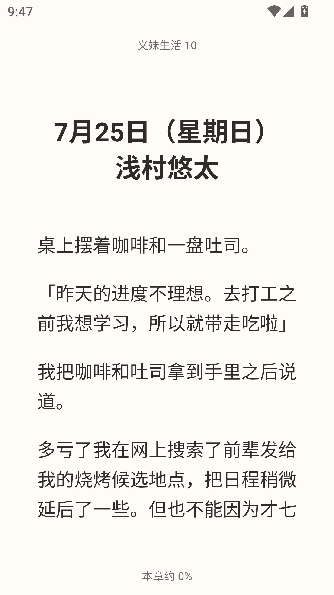

<div align="center">
  
  <h1>Shiori</h1>
  <p>An offline EPUB/TXT novel reader built with Flutter · Android / iOS</p>
  <p>English · <a href="README.zh-CN.md">简体中文</a></p>
</div>

---

Shiori is an offline reader. Books are imported from device files; the bookshelf, reading progress and typography preferences stay on the device.

> The project is licensed under [Apache-2.0](LICENSE). Release procedures are described in [the release guide](docs/release/README.md) (Chinese).

## Screenshots

| Bookshelf | Reader | Catalog |
| --- | --- | --- |
|  |  |  |

## Features

- **Local library** — import TXT and DRM-free reflowable EPUB 2/3 via the system file picker, "Open with" or share sheet. Identical files are deduplicated; files with the same name but different contents are treated as different books.
- **Bookshelf & continue reading** — grid/list shelf with covers, a continue-reading entry and reading history; progress is stored as semantic positions and survives restarts.
- **Catalog & navigation** — EPUB nested table of contents with in-page anchor jumps; TXT chapters are detected from heading patterns.
- **Reading & typography** — tap or drag to turn pages, cross-chapter navigation; adjustable font size, line height, paragraph spacing, five margin levels and paper themes. Reading position is preserved using semantic anchors across typography changes.
- **Reparse** — re-parse imported books from the archived original with the latest rules, preserving reading positions where possible; approximate recovery is clearly indicated. No delete-and-reimport needed.
- **In-book links** — EPUB footnotes and auxiliary documents open temporarily via "chapter links" and return to the previous reading position.
- **Appearance & language** — light, dark, follow-system themes with several accent colors; Chinese / English UI.

## Releases

Version 1.0.0 is now published: download the signed APK from the [v1.0.0 release page](https://github.com/Memory1031/shiori-local-reader/releases/tag/v1.0.0), with `SHA256SUMS.txt` and release metadata attached.

[Shiori 1.0.0](docs/release/notes/v1.0.0.md) · [GitHub Releases](https://github.com/Memory1031/shiori-local-reader/releases)

## Usage

1. **Add books**: pick TXT / EPUB files via "More → Import", or open/share them to Shiori from other apps and confirm in-app. Importing keeps a managed copy inside the app.
2. **Start reading**: tap a book on the shelf or the continue-reading entry; tap the middle of the page to bring up the toolbar for the catalog, chapter links or typography settings.
3. **Remove books**: removing a book from the shelf or detail page deletes the managed copy and its reading progress; **the external original file is untouched**.

### How rendering works

- Regular content — text, images and headings — is paginated using Flutter’s rendering pipeline.
- A small set of short EPUB special pages (title pages with floats, positioning or vertical writing) is rendered through a **restricted static WebView**: scripts disabled, external requests blocked, resources inlined.
- This is not a complete EPUB implementation: DRM, PDF, full fixed layouts and the full CSS cascade are unsupported; CJK typesetting is regular horizontal text without advanced vertical or grid layout. See the support matrix in [Local Import](docs/local-import.md) (Chinese).

## Development

Pinned to **Flutter 3.38.4 / Dart 3.10.3**. Android builds need JDK 17, SDK 36 and NDK 28.2.13676358; iOS builds need macOS / Xcode.

With FVM installed (macOS / Linux):

```sh
fvm install 3.38.4
export PUB_HOSTED_URL=https://pub.flutter-io.cn
fvm flutter pub get --enforce-lockfile
fvm flutter devices
fvm flutter run --target lib/main.dart
```

To explore the bookshelf and reader with synthetic books, run the development entry point:

```sh
fvm flutter run --target lib/main_dev.dart
```

The available scenarios and controls are described in [Development Notes](docs/development.md#离线开发入口与样本) (Chinese).

Offline tests, formatting, static analysis and database generation commands are in [Development Notes](docs/development.md) (Chinese). Version constraints follow [.fvmrc](.fvmrc) and [pubspec.yaml](pubspec.yaml).

## Documentation

| Document | Contents |
| --- | --- |
| [Docs index](docs/README.md) | Entry point for architecture and module guides |
| [Architecture](docs/architecture.md) / [Contracts](docs/contracts.md) | Domain identity, composition, storage and cross-layer contracts |
| [Reader](docs/reader.md) / [Local Import](docs/local-import.md) | Reading behavior, format compatibility and limits |
| [Development](docs/development.md) / [CI](docs/ci.md) | Environment setup, tests and quality checks |

Guides are currently written in Chinese; commit messages follow an English convention.

## Feedback

Include the app version, device and OS version, reproduction steps, expected and actual behavior, and screenshots if possible. For EPUB compatibility issues, provide a minimal reproducible sample or a structure description; never upload passwords, personal data or full books you lack the rights to share.

## Privacy & License

The bookshelf, progress, preferences and imported copies stay in app-local storage. Android system backups and device migration may include this data. Books are supplied entirely by the user; development and tests use synthetic fixed-seed samples.

Project code and brand image assets are licensed under [Apache-2.0](LICENSE); third-party components keep their own licenses. Branding consists of a bookmark icon and the Shiori wordmark — provenance is documented in [assets notes](assets/branding/README.md); the dependency license inventory is in [release docs](docs/release/dependencies.md).
